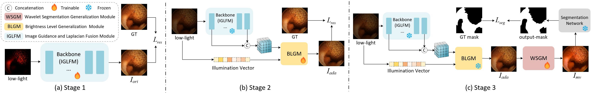
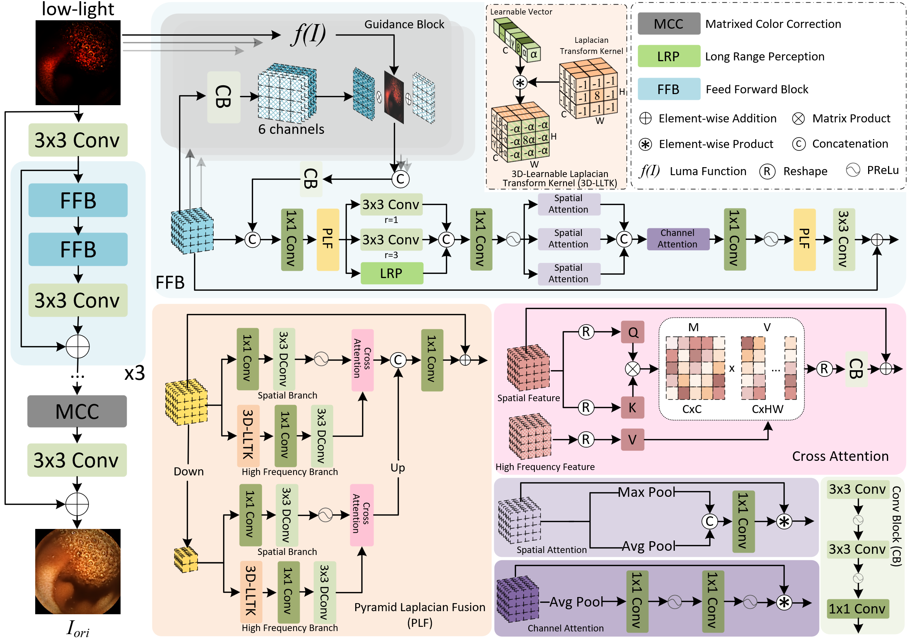
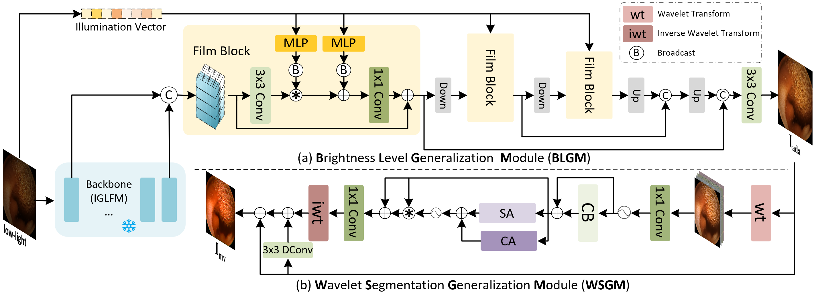

**This is the official repository of**

**"A Dual-Generalization Low-Light Enhancement Framework for Capsule Endoscopy Image Restoration and Segmentation".**

**IEEE TRANSACTIONS ON MEDICAL IMAGING 2025**

**Shuocheng Wang, Jiaming Liu, Ruoxi Zhu, Chengkang Huang, Minge Jing, and Yibo Fan**

**State Key Laboratory of Integrated Chips and Systems, Fudan University**


## Abstract

In recent years, deep learning technology has automated the diagnosis of gastrointestinal (GI) tract disease, enabling doctor-machine collaborative diagnosis. However, the images captured by wireless capsule endoscopy (WCE) easily suffer from insufficient illumination due to the complex structure of GI tract and the limitations of light source, which impacts both human and machine diagnostic accuracy. Moreover, the image features required for human visual inspection and machine-based diagnosis are different, making the images obtained by general low-light enhancement algorithms often unsuitable for machine-based tasks such as image segmentation. To address these issues, we propose a dual-generalization framework for low-light WCE images. Our framework includes an Image Guidance and Laplacian Fusion Module (IGLFM), a Brightness Level Generalization Module (BLGM) and a Wavelet Segmentation Generalization Module (WSGM). IGLFM and BLGM can restore low-light images across different brightness levels and WSGM is designed to enhance segmentation performance. With BLGM and WSGM, our framework enables two aspects of generalizations: generalization to input images with different luminance levels, and generalization to different downstream diagnostic tasks (human perception and image segmentation). Extensive experiments demonstrate that our method achieves significant improvements in both visual quality and segmentation performance, surpassing the existing state-of-the-art (SOTA) method by 4.62 dB in PSNR and 0.022 in SSIM on Kvasir-Capsule dataset. Our code will be available at https://github.com/superwsc/Dual-Gen-Frame.


## Framework

Overview of our proposed dual-generalization framework:



Overview of our Image Guidance and Laplacian Fusion Module (IGLFM):



Overview of Brightness Level Generalization Module (BLGM) and Wavelet Segmentation Generalization Module (WSGM):




## Installation

For installing, follow these instructions

```
conda create -n DGF python=3.9
conda activate DGF
conda install pytorch=2.7 torchvision=0.22 cudatoolkit=11.3 -c pytorch
pip install requirements.txt
```


## Pretrained models and Datasets

 https://pan.baidu.com/s/1XPxP-p05YdbbVRgy1RR-AA?pwd=4240 提取码: 4240

## Inference

If you just want to use the backbone  (IGLFM),, you can change the --input_dir,  --restore_dir, --weights in **inference.py**. And use the command:

```
python inference.py --save_images --restore
```

If you just want to use the backbone  (IGLFM) and BLGM,, you can change the --input_dir,  --restore_dir,  --post_dir, --weights, --post_weights in **inference.py**. And use the command:

```
python inference.py --save_images --restore --post
```

The --input_dir should have 2 subfolders named as 'high' and 'low'.

## Evaluation (PSNR, SSIM, LPIPS)

```
python evaluation.py -dirA path1 -dirB path2
```

## Training

### Training of IGLFM

Modify the training_IGLFM.yml. 

```
python trainIGLFM.py 
```

### Training of BLGM

Modify the training_BLGM.yml. 

```
python trainBLGM.py 
```

The TRAIN_DIR_KCL, TRAIN_DIR_RLE,  VAL_DIR_KCL, VAL_DIR_RLE should have 2 subfolders named as 'high' and 'low'.


If you find our code or paper useful, please cite our paper and give us a star ⭐!

